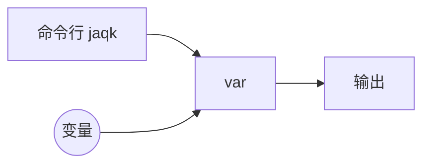
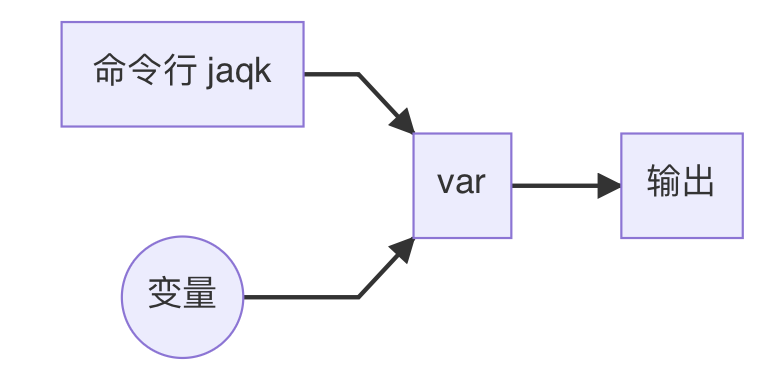
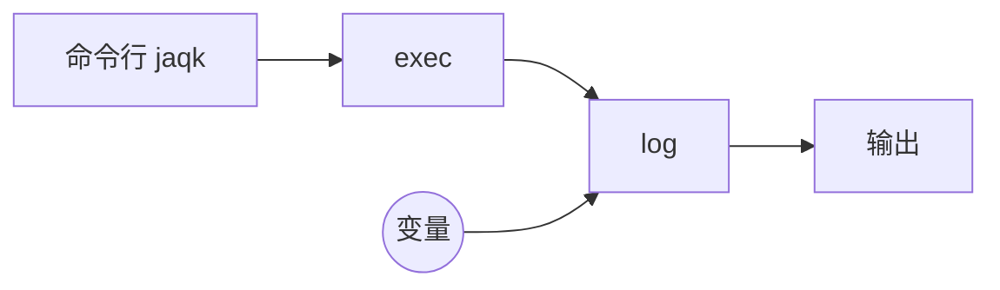
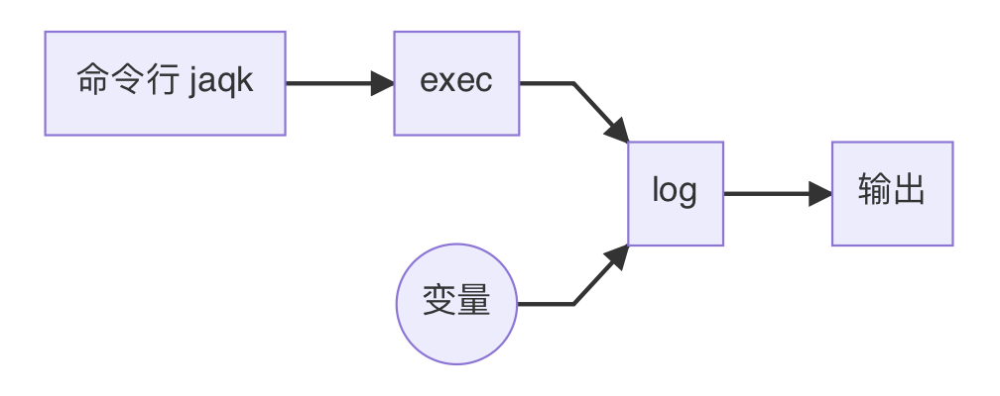
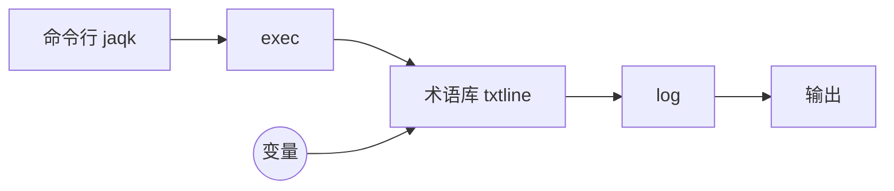
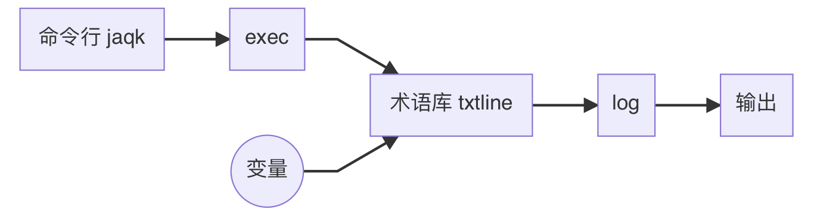

#从零开始学习 jaqk 命令行

# 一、背景

>  一切编程语言都离不开数据结构+算法，而它们本质上都是文件。

然而对于使用者来说，调用计算机的一些功能辅助自己工作这件事本不需要编程门槛，所以不论是乔布斯还是比尔盖茨这些先驱者都不约而同地将计算机进行了界面化革命。

可以说 GUI 软件给我们带来了便利也同时带来了困扰，80%的软件问题来源于 GUI 界面本身，因此我们摒弃 GUI 操作依然采用最原始但是最高效的 CLI 命令行界面，不同的是 我们把 CLI 语义化。

如果说语言由语素和结构构成，那么 jaqk 命令行就是一种 脚本+变量 的构成模式，不论是脚本还是变量都首先是文件，但是为了方便 jaqk 命令行识别，也同时方便编辑器识别特定文件，我们把 脚本文件的后缀统一成 `.js` ，把 变量文件的后缀统一成`.var` ，这样在语义层面达到统一。

> 试问：.js.var 文件是什么语义呢？那 .var.js 呢？

# 二、文件后缀链

## 1、后缀 `.js`

脚本，被 `exec` 命令检索

## 2、后缀 `.jaqk`

需要 `jaqk` 预处理的文件，例如加密文件

被 `exec` 和 `var` 命令检索

## 3、 中缀 `.debug`

用于调试的脚本文件，开发阶段使用，文件结尾处会带有如下语句:

```
module.exports = ...
```

被 `exec` 命令检索。

## 4、中缀 `.lib`

可以作为库文件被其他 脚本 引用。

## 5、后缀 `.var`

被看作是变量的文件

被 `var` 命令检索。

## 6、中缀 `.json`

将以 json 格式解析为 `js object` 的变量

被 `var` 命令检索。

## 7、中缀 `.txtline`

将以纯文本按行的形式解析成 `string array` 的变量

被 `var` 命令检索。

## 8、中缀 `.config`

将以纯文本每行 **`key=value`**  形式解析成 `js object` 的变量，其中 key 同名的 value 值被归纳为 key 名的数组。

被 `config` 脚本以 `.txtline` 的方式检索

即将 直接被 `var` 命令检索。

# 三、指定脚本来源

虽然脚本都是文件，但是 jaqk 命令行根据脚本名称结构识别脚本来源，主要有以下三处来源：

- jaqk 命令行自带脚本，直接使用 **`脚本名`** 访问，取决于官方是否认为是通用需求从而加入该来源，同时有较高重名风险。

- 第三方库脚本，使用 **`@库名/路径/脚本名`** 方式访问，可以按照自己的业务模式进行组织，只要完整路径不重名，脚本名可以重名。
- 本地脚本，使用 **`完整路径/脚本名`** 方式访问，不太灵活，但是无重名风险，仅用于一般性测试，一般不会收录。

> 注意⚠️：脚本名不是文件名，需要去掉文件名中的中缀和后缀，jaqk 命令行只关心脚本名称，但是变量名称需要携带完整中缀。

# 四、以不同方式输出并打印变量

## 2.1 var 命令打印原始变量

> \> jaqk var test.txtline

```
zhuofanerdeMacBook-Pro:~ zhuofaner$ jaqk var test.txtline
[
  [
    '# 假的 哈哈哈',
    '我是程序员',
    '',
    '# 真的 哈哈哈😂',
    '我今天很开心',
    '',
    '  #才接触1个小时',
    '这是第一天开发',
    '',
    '    # 装逼嘛 都懂得',
    '可以发个朋友圈'
  ]
]
```

var 命令会首先把所有变量以数组方式打印，其次这里只有一个变量 `test.txtline` 根据后缀(txtline同时是变量后缀也是文件中缀)字符串数组方式呈现。

数据流程图：





## 2.2 log 脚本输出美化后的变量

> \> jaqk exec log test.txtline

```
zhuofanerdeMacBook-Pro:~ zhuofaner$ jaqk exec log test.txtline
SIMPLELOG >>>
# 假的 哈哈哈
我是程序员

# 真的 哈哈哈😂
我今天很开心

  #才接触1个小时
这是第一天开发

    # 装逼嘛 都懂得
可以发个朋友圈
```

log 脚本把 `test.txtline` 变量以字符串按行的方式原始打印了出来，同时添加默认打印样式头 SIMPLELOG >>>

数据流程图：




## 2.3 txtline 脚本过滤注释和空行;只输出有用数据

> \> jaqk exec @jaqk-util/script/txtline test.txtline ] log

```
zhuofanerdeMacBook-Pro:~ zhuofaner$ jaqk exec @jaqk-util/script/txtline test.txtline ] log
SIMPLELOG >>>
我是程序员
我今天很开心
这是第一天开发
可以发个朋友圈
```

数据流程图：





