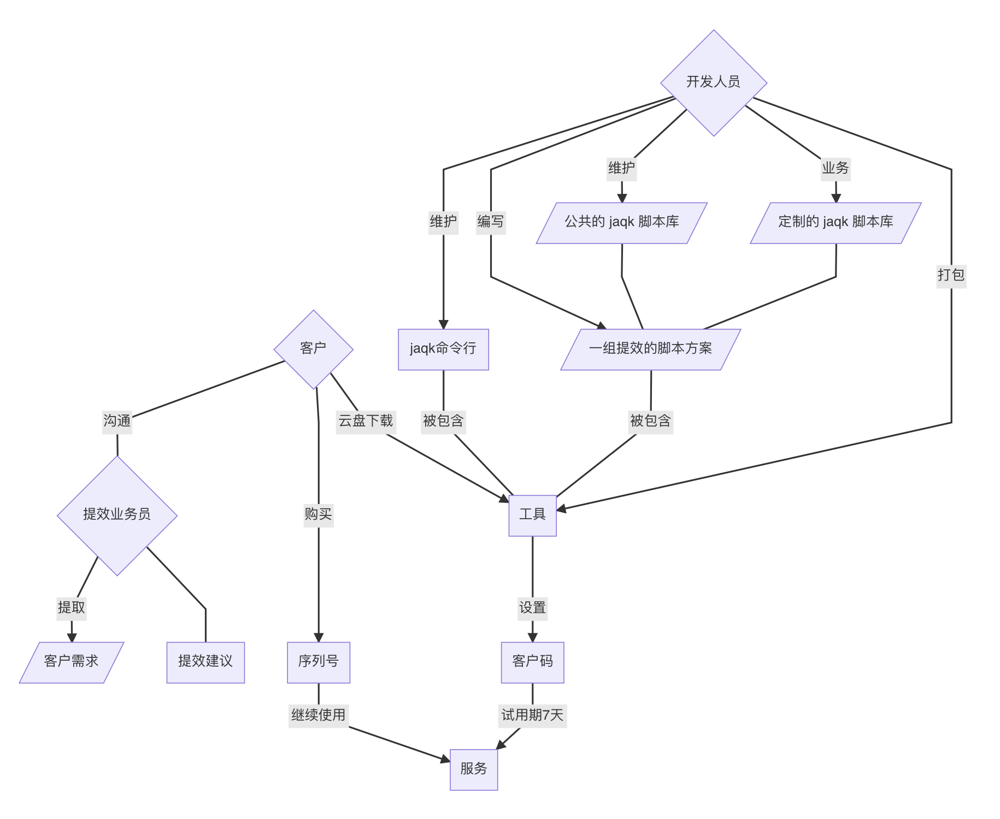

# JAQK 个人命令行提效工具

为个人打造的一款定制化命令行效率工具

[English Document](./README.en_US.md)

# 典型场景

## 从多个网站页面间切换获得特定数据

> jaqk 命令行从网页接口直接爬取数据，避免低效的 GUI 操作

## 打开多个应用进行数据中间处理

> 多个应用切换消耗系统资源，更有可能在切换中搞混或者搞丢表格或数据，jaqk 直接通过脚本链的方式进行全部的数据处理，一次性获得最终数据

## 花费较多时间在一个固定的流程上，重复且低效

> jaqk 命令行将某个固定流程的步骤或行为录制成 “宏” 提供下次自动化完成，您只需要提供诸如拖拽变量文件等差异化的行为

## 对个性化数据进行可视化展示

> 将海量数据以可视化方式呈现。通过对接可视化图形库在客户端即时呈现图形化数据，方便进行二次创作(PPT、文稿)和决策分析

## 可视化的流程编排

> 当出现非预期的数据时，通过将中间结构的结果数据进行分步打印，可视化地排查数据在流程化处理过程中的问题，从而实时调整流程脚本或参数，以满足个人业务中非预期情况下的特殊情况

## 常用的行业术语库

> 针对不同领域构建自己的专业术语库，对常见的行业使用场景提供解决方案

## 可本地化部署，搭配企业级应用使用，无缝插入现有的工作流，数据不外流安全可靠

> 可离线使用并通过激活码激活，满足企业内部对于数据的保密要求，附带必要工具无需外网且无需复杂的部署行为，数据的生成、加工、保存都在本地不会外流。jaqk提效师也仅仅是通过编写命令行脚本完成需求，是否满足需求完全由客户在自己的工作场景中验证

## 需要个人效率方案师跟进业务变化，实时提供最佳实践流程

> 非企业级应用，仅需下载一个客户端，试用我们提供的通用演示功能。联系我们的个人提效业务员，获得定制化的客户端软件(内含定制化脚本)，获得免费的试用码，期间可随时提出您的个人偏好，好用后进行付费使用，一人一码，永久跟踪需求变更

# 业务图

关键路径如下：
- 客户向提效业务员提出自己的业务痛点，提效业务员给出部分建议以及归纳客户需求给开发人员

- 开发人员提取公共需求，升级和开发公共 jaqk 脚本库，并根据定制性需求进行定制化脚本开发

- 开发人员提交打包后的工具，提效业务员生成客户码提供用户免费试用，试用期间客户可提出任何需求和改进意见或BUG反馈给开发，开发调教参数或开发脚本以改进软件再次交付用户直到用户体验符合自己的需求为止

- 客户付费购买服务或试用码到期未付费软件暂停相应功能

业务联系电话: 13370108205